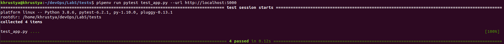
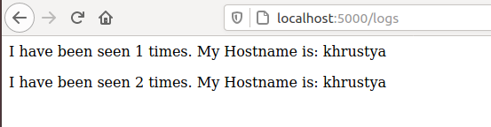

# Lab5
### 1. Ознайомилась з docker-compose.
### 2. Ознайомилась з бібліотекою Flask.
### 3. Створила папку my_app, tests. Скопіювала файли з репозиторію devops_course.
### 4. Виконала наступні команди:
####pip3 install redis
####pipenv --python 3.8
####pipenv install -r requirements.txt
####pipenv run python app.py
### 5. Відкривши нову вкладку терміналу я запустила наступну команду:
####pipenv run pytest test_app.py --url http://localhost:5000
### 6. Створила папку logs (в папці з додатком), в якій створила файл app.log
#### 
### 7. Видалила файли, які були створені після тестового запуску, а також створила файли => Dockerfile, Makefile
### 8. Опис директив мейкфайлу:
#### docker-prune - видалення контейнерів, волюмів, мереж та імеджів
#### run - директива для створення мережі
#### PHONY - дозволяє оголошувати фальшиві цілі
#### STATES - змінна для збереження директив
#### test-app - директива для запуску контейнера з тестами
#### $(STATES) - директива для білда контейнера
#### REPO - змінна для збереження назви Docker репозиторію
### 9. Запустила додаток та переконалась, що він робочий
#### 
#### 
### 10. Створила директиву push - слугує для завантаження імеджів у Docker Hub репозиторій
### 11. Cтворила директиву remove для видалення локальних імеджів.
### 12. Я створила компоуз файл,в якому було створено дві мережі(public та secret). Запустила docker-compose.
### 13.Сайт працює. Адреса: localhost:80
### 14. Композ створив Docker імеджі
####bobas/lab4-examples compose-tests
####bobas/lab4-examples compose-app
####python 3.7-alpine
####python 3.7-alpine
### 15. Змінила тег імейджів, перезапустила docker-compose та почистила імейджі за допомогою remove
### 16. Зупинила проект (Сtrl+C), очистила ресурси створені компоузом.
### 17. За допомогою команди docker-compose push завантажила створені імеджі в репозиторій.
### 18.  Як на мене, краще docker-compose.yml;
### 19. Створила docker-compose.yml для лабораторної №4
